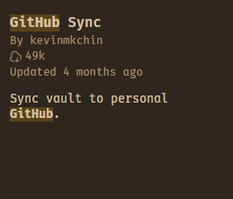
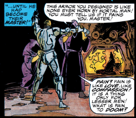
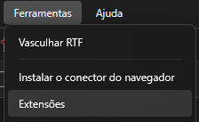
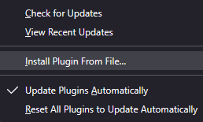

## One App to Rule Them All {#pipeline}

<blockquote class="epigraph">To revere mementos of the past is sometimes labeled sentimental or
antiquarian by people who thoughtlessly repeat the cliché that to live fully we
must concentrate on the present or the future and not dwell on the past.
Ignoring the past, however, is not a choice that we have: to live fully
presumably involves, by any definition, taking in our surroundings, making
them our own, even if that comes to mean the embracing of chaos and
alienation; and this process brings us face to face with the past, for
everything we encounter is from the past. Our world is a world of artifacts.
(Whether we choose to believe that objects owe their existence to our
perception is irrelevant in this regard, for we still distinguish two levels
of creativity: what we imagine that we have inherited, and what we do with
it.) <footer>G. Thomas Tanselle, <em>A Rationale of Textual
Criticism</em>[^3]</footer></blockquote>

So you want to finally overwork your simple academic assignments and stop using NotebookLM because you cannot remember a passage you read months ago?

It seems you came to the right place...[^1]

### Git, GitHub, and Obsidian {#git}

So, first of all, if you want complete control over your notes, I strongly recommend having Git (which is absolutely necessary for some Zotero extensions), a Github/Gitlab account and Obsidian.[^2] Git can be downloaded from its own site: [git-scm.com/download/win](https://git-scm.com/download/win) (since this is for absolute beginners, yes, you are using Windows x64). It's pretty easy, I promise I'm not trying to make you all use Emacs.

There are even tools, like LazyGit, that allow you to understand Git processes through visualization (UI). I still think it's a very interesting repo, but you don't really need it if you are a beginner, just ask an AI for the steps.

Set up a Github account, create a private repo and use the Obsidian extension to connect with your repositories as your archive.

Just click on repositories and hit "New"

And in your Obsidian vault, you just need to allow for community plugins and then search "Github".

Trust me, this is going to make finding everything in the future way easier.

### Zotero and Zotero-Scipdf {#zotero}

Now, for Zotero, download it from [zotero.org/download](https://www.zotero.org/download/) (and also its Connector for the browser).

For the thing that everyone is way more eager to use, it is called Zotero-Scipdf. First, you need to download Zotero and put its extension in your browser. Then, download the first file from this list here: [zotero-scipdf releases (v8.1.0)](https://github.com/syt2/zotero-scipdf/releases/tag/V8.1.0). With it in your Downloads, go to Tools and click on install add-on from file.

After that you just have to click Fetch PDF and it will search automatically (you can forget plenty of information, except the article's DOI, or it won't find anything).

But what about the other ones?

### Better Notes and Syncing {#better-notes}

Do you remember we talked about Obsidian? The nicest way is probably to download it and set it up to push your changes to Github right away. For that, I would install [zotero-better-notes](https://github.com/windingwind/zotero-better-notes/releases). And then you just pull the notes in Markdown and drop them there. With everything set up in Obsidian and Github, you will never have to worry about this again.

### OCR with Tesseract {#ocr}

What about OCR?

You will need the open-source OCR engine called Tesseract. It's pretty easy, and once installed it even works inside your Terminal, without the need of Zotero.

The latest installer can be downloaded here: [tesseract-ocr-w64-setup-5.5.3.20260724.exe](https://github.com/tesseract-ocr/tesseract/releases/download/5.5.3/tesseract-ocr-w64-setup-5.5.3.20260724.exe) (64 bit).

And then you need to go to [zotero-ocr-0.9.5.1.xpi](https://github.com/UB-Mannheim/zotero-ocr/releases/download/0.9.5.1/zotero-ocr-0.9.5.1.xpi) and do the same installation process as the other extensions (install the `.xpi` as a plugin in your Zotero).
